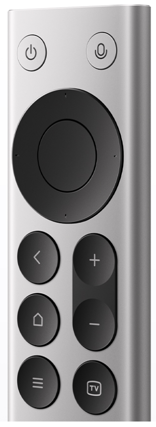

# Axonkey

<p align="center">
  
</p>

Axonkey 是一款面向小米 RC003 蓝牙遥控器的 Windows 与 macOS 本地按键映射工具。Windows 版通过 Interception 驱动识别指定物理设备（`VID 0x2717` / `PID 0x32B8`）；macOS 版通过 IOKit 读取同一设备的原始 HID 报告，并用 CoreGraphics 发送映射后的输入。两个平台都只处理目标遥控器，普通键盘不会进入映射流程。

项目目前专注于一个设备和一件事：让 RC003 成为可靠、易配置的快捷键控制器。Axonkey 不依赖 AutoHotkey、AutoHotInterception 或 Karabiner-Elements，配置和诊断数据均保存在本机。

## 主要功能

- 识别 RC003 的连接状态与输入后端状态；Windows 版同时读取电量。
- 为每个可识别按键分别配置单击、双击和长按行为。
- 直接选择常用行为，包括保留原按键、禁用、导航编辑和媒体控制。
- 支持单个按键、键盘录入、组合键，以及左/右 Alt 等单独修饰键。
- 支持按顺序执行多个步骤，例如粘贴文本、等待和按下 Enter。
- 内置“输入文本并回车”行为：粘贴文本 -> 等待 30 ms -> Enter。
- 修改后自动保存并立即应用，无需为普通映射变更重启 Windows。
- 只处理匹配 VID/PID 的目标设备，不修改普通键盘的按键行为。
- Windows 首次引导可安装并检查 Interception 与 VB-Audio VB-CABLE；macOS 首次引导检查输入监控和辅助功能权限。

## 支持范围与限制

当前只支持小米 RC003 蓝牙遥控器。可配置的实体按键包括语音、电源、方向、确认、主页、菜单和 TV 键。

返回键和遥控器上的独立音量 `+ / -` 键暂时不能作为映射触发键。Windows 无法可靠区分这些按键事件来自哪台输入设备；macOS 原生后端虽然能从 RC003 HID 报告识别它们，但当前编辑器仍保持与 Windows 相同的十键范围，并原样转发这些系统按键。其他可识别按键仍然可以映射为系统音量增大、减小或静音。

当前版本不计划支持：

- 其他遥控器或普通键盘型号；
- Linux；
- 云端账号、配置同步或遥测；
- 任意脚本、应用专属配置或通用自动化编辑器。

## 默认映射

| RC003 按键 | 单击行为 |
| --- | --- |
| 语音键 | 右 Alt（`RAlt`） |
| 电源键 | Escape（`Esc`） |
| 方向、确认、主页、菜单和 TV 键 | 保留原按键 |

## 系统要求

### Windows

- 64 位 Windows 10 或 Windows 11；
- 已通过 Windows 蓝牙设置配对的 RC003；
- Interception v1.0.1 输入驱动；
- 需要虚拟麦克风时安装 VB-Audio VB-CABLE Pack45；
- 首次安装或卸载上述驱动时需要管理员权限，并需要重启 Windows 一次。

Axonkey 使用 x64 Interception 运行库，因此不支持 32 位 Windows。

### macOS

- macOS 13 Ventura 或更高版本，支持 Apple Silicon 与 Intel；
- 已通过系统蓝牙设置配对的 RC003；
- 在“隐私与安全性”中授予 Axonkey“输入监控”和“辅助功能”权限。

macOS 不需要安装输入驱动。未启用自定义映射，或两项权限尚未同时授予时，Axonkey 只做非独占设备监听，不会吞掉遥控器原始按键。启用映射且权限就绪后，应用会优先独占匹配的 RC003 HID 设备；如果系统不允许独占，则继续监听 HID 报告，并通过事件过滤器只拦截对应的 RC003 原始按键，再发送映射后的输入。

## Windows 首次使用

1. 在 Windows 蓝牙设置中配对并唤醒 RC003。
2. 启动 Axonkey，按照首次使用引导检查设备和驱动。
3. 在“驱动安装”页面依次安装 Interception 和 VB-CABLE；两个安装器都完成后重启 Windows 一次。
4. 重新打开 Axonkey，选择遥控器按键及触发方式，然后设置目标行为。
5. 打开“启用自定义按键功能”开关。

两个驱动都只需安装一次。之后添加、删除或修改映射不需要再次重启。

从源码目录或解压后的发行目录也可以手动运行安装脚本：

```powershell
powershell -ExecutionPolicy Bypass -File .\scripts\install-driver.ps1
```

脚本会校验随项目提供的 Interception 安装程序和运行库，说明系统变更，要求输入 `INSTALL` 确认，然后申请管理员权限。

也可以手动启动仓库中经过校验的 VB-CABLE 安装流程：

```powershell
powershell -ExecutionPolicy Bypass -File .\scripts\vbcable-driver.ps1 -Action install
```

该脚本校验未修改的官方 Pack45 ZIP、x64 安装器哈希和发布者签名，随后申请管理员权限并打开 VB-Audio 官方安装窗口。安装完成后需要重启 Windows，录音设备列表中会出现 `CABLE Output (VB-Audio Virtual Cable)`。

## macOS 首次使用

1. 在 macOS 蓝牙设置中配对并唤醒 RC003。
2. 启动 Axonkey，在首次引导中依次请求“输入监控”和“辅助功能”权限。
3. 返回 Axonkey 并重新检测权限；如果“输入监控”没有立即生效，请重新启动应用。
4. 配置目标行为，然后启用“自定义按键功能”。

退出 Axonkey 或关闭自定义映射会释放 HID 访问并停止事件过滤器，遥控器恢复由 macOS 直接处理。

## 卸载输入驱动

先退出 Axonkey 和其他使用 Interception 的工具，再运行：

```powershell
powershell -ExecutionPolicy Bypass -File .\scripts\uninstall-driver.ps1
```

脚本要求输入 `UNINSTALL` 并申请管理员权限。卸载完成后需要重启 Windows。

## 本地开发

开发环境需要 Node.js 与 Rust stable。Windows 还需要 MSVC 构建工具和 WebView2；macOS 需要 Xcode Command Line Tools。安装依赖并启动 Tauri 桌面应用：

```powershell
Copy-Item .env.example .env
npm install
npm run tauri dev
```

`.env` 是本机版本来源并被 Git 忽略，只允许包含一行 `version=vX.Y.Z`。首次检出时从已提交的 `.env.example` 复制；`make release` 会同时更新本地 `.env`、`.env.example` 和各框架清单中的版本。

检查前端生产构建和 Rust 测试：

```powershell
npm run build
cargo test --manifest-path .\src-tauri\Cargo.toml
```

项目也提供 Makefile：

```powershell
make dev
make build
make build-macos
make test-release
make release
make release V=v0.2.6
```

`make build` 只校验 `.env` 与仓库版本是否一致，然后调用 Tauri 构建当前平台安装包；它不会修改文件、提交或创建 Git 标签。Windows NSIS 输出为：

```text
src-tauri\target\release\bundle\nsis\Axonkey_<version>_x64-setup.exe
```

`make build-macos` 使用同一版本校验，并生成当前架构的 `.app` 与 `.dmg`：

```text
src-tauri/target/release/bundle/macos/Axonkey.app
src-tauri/target/release/bundle/dmg/Axonkey_<version>_<arch>.dmg
```

设置 `APPLE_SIGNING_IDENTITY` 后，`make build-macos` 会用该证书签名 App 和 DMG；不设置时回退到 ad-hoc 签名。输入监控和辅助功能权限绑定代码签名身份，经常安装本地构建时应固定使用同一签名证书。ad-hoc 构建每次变化后都可能需要移除旧权限条目并重新授权。

面向外部用户分发时必须使用稳定的 Developer ID Application 身份并配置 Apple 公证凭据，不能把 ad-hoc CI 产物作为可延续系统权限的正式安装包。

`make release` 要求 Git 工作区完全干净。未传 `V` 时，它从 `.env` 递增 patch；也可以用 `V=vX.Y.Z` 指定版本。命令会同步 `.env.example`、npm、Cargo 和 Tauri 版本，创建 `chore: release vX.Y.Z` 提交，再在该提交上创建 annotated tag。它不会构建、推送或发布远端 Release。

## GitHub Tag 自动构建

先在 `main` 的干净工作区运行 `make release`，再推送 release commit 和 annotated tag：

```bash
git checkout main
make release V=v0.2.6
git push origin main --follow-tags
```

Tag 必须采用 `vMAJOR.MINOR.PATCH` 格式并指向 `main` 历史。GitHub Action 会从 `.env.example` 初始化 CI 的 `.env`，然后校验 Tag、`.env.example` 和所有已提交清单版本完全一致；CI 不会临时重写版本。

两个平台都构建成功且 SHA-256 校验通过后，工作流才会创建或更新对应的 GitHub Release，并上传
Windows NSIS、macOS Universal DMG 及各自的校验文件。相同文件也会作为 GitHub Actions Artifact
保留 30 天。如果 Tag 指向的提交不属于 `main` 历史，工作流会拒绝构建。目标分支可通过工作流中的
`RELEASE_BRANCH` 修改。

macOS Action 支持以下 Repository Secrets：

- Developer ID 签名：`APPLE_CERTIFICATE`（Base64 编码的 `.p12`）、`APPLE_CERTIFICATE_PASSWORD`、`APPLE_SIGNING_IDENTITY`；
- Apple 公证：`APPLE_ID`、`APPLE_PASSWORD`（App 专用密码）、`APPLE_TEAM_ID`。

签名或公证凭据必须按组完整配置。六项全部配置时，工作流会先签名 App 和 DMG，再对移除隐藏卷图标后的最终 DMG 执行公证和 stapling。未配置时仍可生成 ad-hoc 签名的测试 DMG，但 GitHub Actions 会给出警告，该产物不适合作为正式外部分发包。

## 工作原理

```text
Windows: RC003 -> Interception -> 扫描码 -> 行为状态机 -> 同设备发送
macOS:   RC003 -> IOHIDManager -> HID usage -> 行为状态机 -> CGEvent 发送
```

输入服务只为识别出的 RC003 设备设置过滤条件。设置更新采用本地快照，界面保存后会直接替换输入服务中的当前配置。

更多实现信息见 [架构说明](./docs/ARCHITECTURE.md) 和 [产品范围](./docs/PRODUCT.md)。

## 隐私与恢复

- Axonkey 不需要账号，不上传映射、输入历史或诊断信息。
- 映射配置保存在本机应用数据中。
- Windows 驱动安装和卸载日志位于 `%LOCALAPPDATA%\Axonkey\logs`。
- 如果映射出现问题，退出 Axonkey 会释放 Windows Interception 上下文或 macOS HID 访问与事件过滤器，原始输入将恢复正常传递。

## Interception 许可

Interception 是独立的第三方组件，并采用双重许可。其上游许可允许在所列 LGPL 条款下进行非商业使用；商业分发需要向 Interception 作者取得单独授权。在取得相应许可前，请勿将包含 Interception 资源的 Axonkey 用于商业分发。

具体版本、文件哈希、许可文本和上游链接见 [THIRD_PARTY_NOTICES.md](./THIRD_PARTY_NOTICES.md) 与 [vendor/interception/SOURCE.md](./vendor/interception/SOURCE.md)。

## VB-CABLE 许可

VB-CABLE 是 VB-Audio Software 提供的 Donationware。Axonkey 原样携带官方 Pack45 ZIP，并在引导中明确展示其来源；如果你认为 VB-CABLE 有用或将其用于专业场景，请通过 [VB-Audio 官方页面](https://vb-audio.com/Cable/) 捐赠或购买许可。

版本、哈希和分发说明见 [THIRD_PARTY_NOTICES.md](./THIRD_PARTY_NOTICES.md) 与 [vendor/vbcable/SOURCE.md](./vendor/vbcable/SOURCE.md)。

## 相关项目

Axonkey 的产品灵感来自 [HD838A/remote-mic-app](https://github.com/HD838A/remote-mic-app)。macOS 原生后端参考了该项目经真机验证的 RC003 VID/PID、HID usage 报告格式、IOKit 权限检查和 CoreGraphics 键盘注入路径；Axonkey 仍维护独立的 Tauri 界面、设置格式与行为状态机。

Axonkey 与 remote-mic-app 是相互独立的项目，本仓库不是其 fork。
